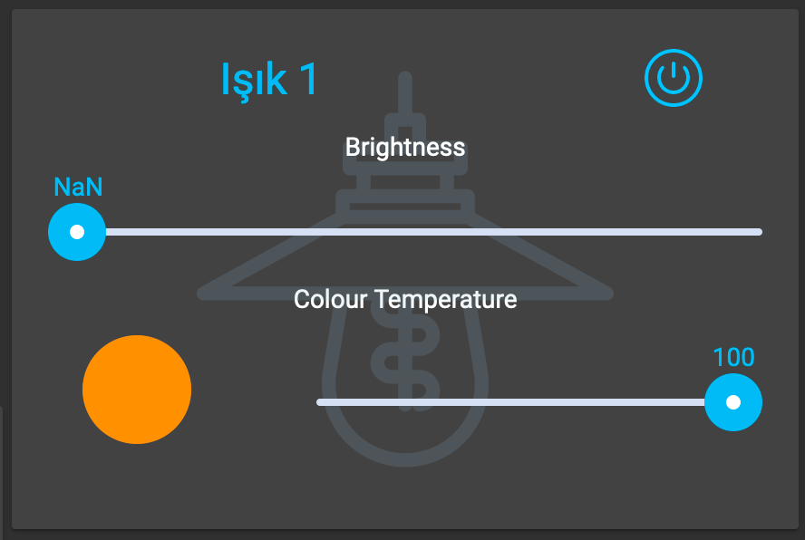

# Hue Light Widget

## Installation

Create a folder named `huelight` under Openhab `html` folder.

> **Hint**: html folder placed under `/srv/openhab-conf/` on rpm installation of Openhab 3

Create `huelight.controller.js` file with content of [this file](huelight.controller.js)

> **Hint**: you can execute following command on `html/huelight` folder to create file also;
> `wget https://raw.githubusercontent.com/fatihboy/habpanel-widgets/main/HueLight/huelight.controller.js`

Finally import [huelight.widget.json](https://raw.githubusercontent.com/fatihboy/habpanel-widgets/main/HueLight/huelight.widget.json) file as a widget on Habpanel.

## Usage

Create new panel and add `Hue Light Widget`. Set **Color** and **Temperature / Brightness** things from its settings. Set **Type** of your Hue Light.

Thats all...
